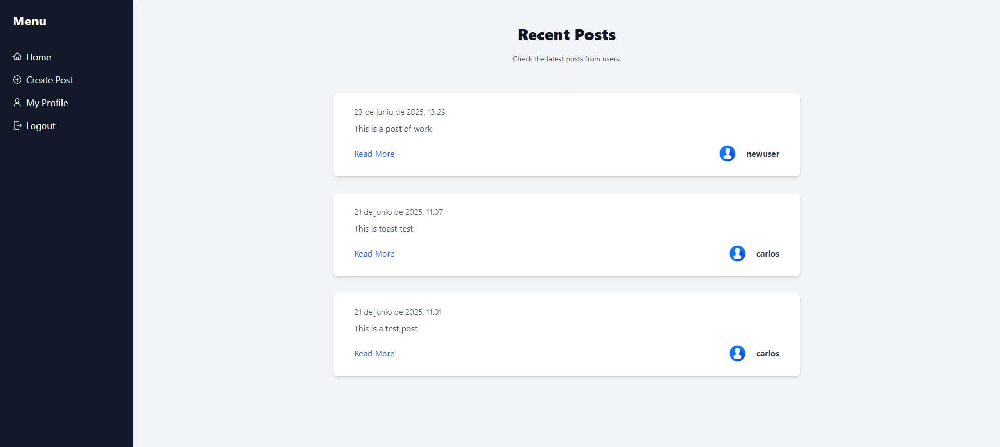
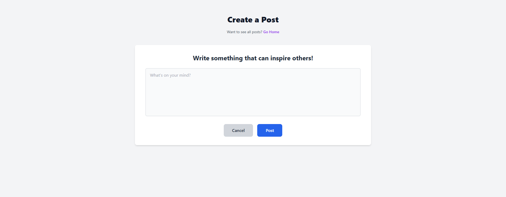
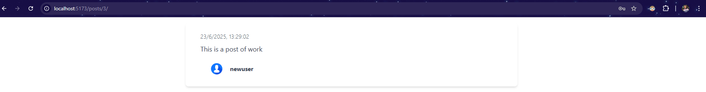

# 📝 Blogsite-Django

Este es un proyecto de blog completo desarrollado con **Django** y un frontend en **React**. Incluye autenticación, publicación de posts, perfiles de usuario, y más.

---
## Funcionalidades
Registro e inicio de sesión
Publicación de posts: vista de detalle
Vista de perfiles
Sistema de seguidores
Interfaz moderna y responsiva

## 📸 Vistas del Proyecto

A continuación se muestran capturas de pantalla del funcionamiento del sistema:






---

## 🚀 Clonación y Configuración

### 🔧 1. Clonar el repositorio

```bash
git clone https://github.com/tu-usuario/Blogsite-Django.git
```
###  2. Crear archivo .env en el backend con las siguientes variables:
```env
SECRET_KEY=tu_clave_secreta
DEBUG=True

EMAIL_BACKEND=django.core.mail.backends.smtp.EmailBackend
EMAIL_HOST=smtp.gmail.com
EMAIL_USE_TLS=True
EMAIL_PORT=587
EMAIL_HOST_USER=
EMAIL_HOST_PASSWORD=


POSTGRES_DB=nombre_de_tu_db
POSTGRES_USER=tu_usuario_db
POSTGRES_PASSWORD=tu_contraseña_db
POSTGRES_HOST=localhost
POSTGRES_PORT=5432
```

### 3. En el frontend, crea un archivo .env con:
```env
VITE_API_URL="http://localhost:8000/api"
```
### 4. Instalación rápida
## Backend
```bash
pip install -r requirements.txt
python manage.py migrate
python manage.py runserver
```

## Frontend
```bash
cd frontend
npm install
npm run dev
```